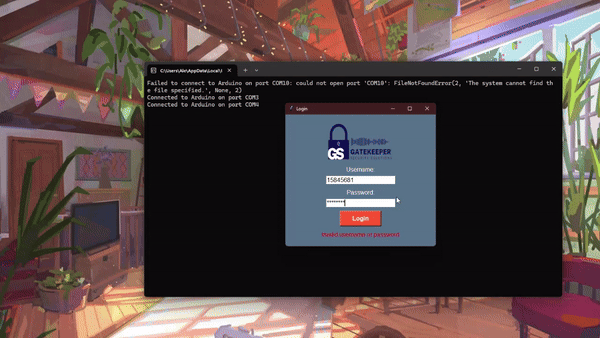

# RFID-Attendance-Access-Control
### Scope
The system covers all aspects of attendance and access management, from user registration to automated attendance recording and access control enforcement, supporting diverse operational needs across sectors.

## System Overview
The system integrates hardware components like Arduino microcontrollers with RFID readers for real-time authentication and data exchange, supported by a centralized software application that provides tools for configuration, monitoring, and reporting.

## Goals and Objectives
- **Goal 1:** Develop and Implement RFID Features
    - **Objective:** Innovate and integrate features to ensure the high level of security for access control.
    - **How:** Through regular technology assessments and collaboration.

## Use Cases
1. **User Registration**
    - Administrators register new users, linking them with RFID tags.
2. **Attendance Tracking**
    - The system automatically records attendance when a user swipes their RFID tag.
3. **Access Control**
    - Access is granted or denied based on RFID authentication, according to predefined rules.

## Functional Requirements
- **FR1:** User Management
- **FR2:** Attendance Management
- **FR3:** Access Control Configuration

## Non-Functional Requirements
- **NFR1:** Performance
- **NFR2:** Security
- **NFR3:** Usability

## Definitions
- **Arduino:** Open-source electronics platform used in our system.
- **RFID:** Technology for wireless identification and tracking.

## Development and References
Development is guided by best practices in RFID technology, embedded systems, and software engineering. References include Arduino documentation, RFID standards, and relevant academic research.

## Conclusion
The RFID Attendance and Access Control System sets a new standard in operational excellence, enhancing both security and user satisfaction by leveraging advanced technologies and user-centric design principles.
